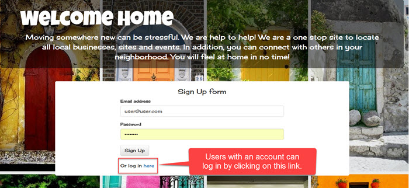

# Welcome-Home

The site for users to find local resources and other newcomers in one place!

Users can access the site by going to http://www.example.com. 

## Landing Page
Once on the landing page, new users will need to create a username and password, or returning users can click on the "log In" link.

## Main Form Page
After logging in or signing up, a user will complete a form and can begin their search.

## Search Page

Once on the search page, the user will enter the zip code for which they would like to search and click on the search icon they would like to use.  

## Results Page

Results are returned to the user.  FInd what is of interest and off they go!

## Neighborhood Page

If a user would like to find other users near them, they can access the neighborhood page and search by city.  

We hope users enjoy our site and *__Welcome Home__*!
 

